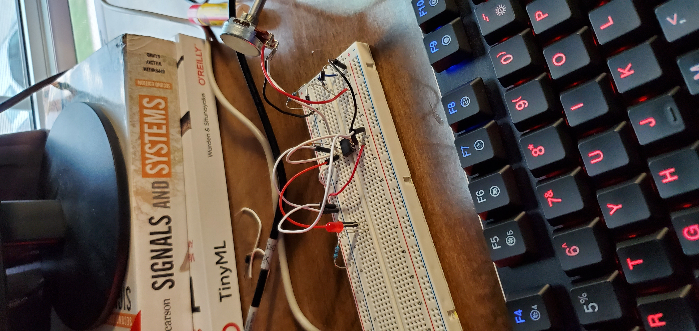
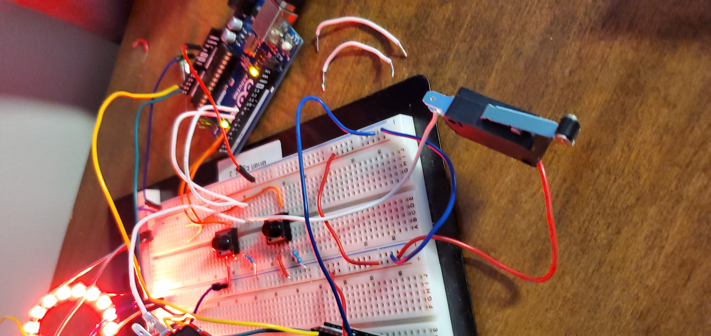
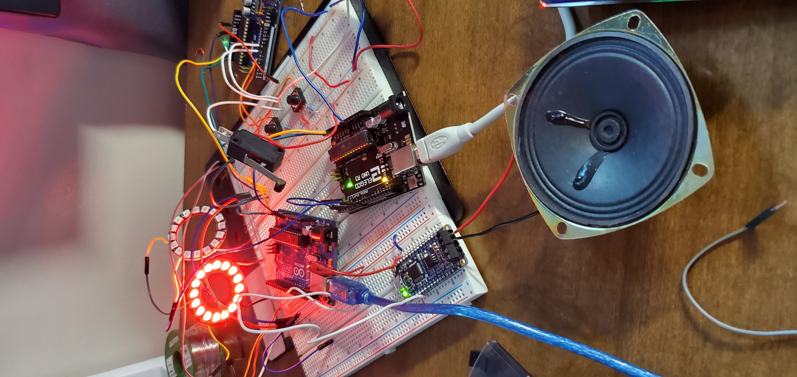
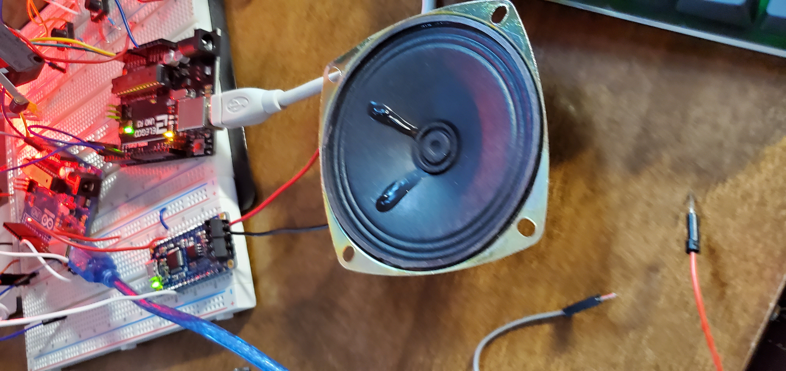

# railroadCrossing
Arduino based railroad crossing replica 

With the coronavirus sending students home for the rest of the semester (spring 2020), I found myself with a lot of extra time on my hands and lots of parts that I have never used.I recalled that the theme for this years VBS at my church is a railroad theme and my idea was born. I decided that I was going to make a railroad crossing signal. You know the ones with the moving arm, sound and blinking lights. It seemed a little easy especially since I am a junior electrical engineering student so I set off to work, needless to say, I encountered many errors and problems that made this a not an “easy” project. Certainly not a “plug and go” anyway lets get started.

Step 1: Gather materials. 

3x Arduino UNOs - $23/ea (arduino.cc)

2x microswitches - $2/ea* (microcenter)

2x pushbuttons - $0.10/ea (digikey)

2x 8Ohm-1W speakers - $2.95/ea (microcenter)

1x adafruit sound effects board $30/ea (adafruit)

2x neopixel ring (16LEDs)

1x barrel jack

1x 5V 3A power supply

2x 10K ohm resistors

Jumper wire

1x 10 ft carpet tude

1x 6ft pool noodle

1x 6ft PVC pipe ½” diameter

2x empty paint can

Black paint

Grey paint

Red paint

White paint

2x 2”x1/4” x3’ pieces of wood

2x MOSFET N-ch 30V transistor

2x MOSFET P-ch 27A transistor

1x 555 timer

1x 125V 3A fuse

2x 10000pf ceramic capacitor

2x 1n4004 diode

1x 19rpm economy brush pur motor

1x 4mm shaft mount 32 pitch 16T gear

1x 32 pitch 64T 1” bore gear

Estimated total cost:
	For those who do not have any previous material the estimated total cost is about $276. This does not include shipping and tax as you will most likely end up ordering from multiple different places. Websites such as Amazon may make it cheaper. I ended up spending just under $100 on parts that I didn’t have. PCB ordering is also not factored into this cost. I usually order PCBs from China. This means that I have to order a minimum of 10 boards per design. Thus with SeedStudio, I will have to pay around $5 for each design as well as shipping and tax for each one. I also included what the cost would be had I been contracted by a client to build this device. I used a simple google search of the median income of an electrical engineer to base my calculation for the per hour pay. 

You may be wondering why I use so many microcontrollers for a relatively simple process. I was limited by 2 main factors in this build, materials that I had, and money. Now, using 3 micro controllers seems like a costly thing to do and it is. However, I was lucky enough to receive a donation of parts last year which included about 10 arduinos. So having these extra controllers was a huge relief because it allowed me to make this project more parallel. In other words, I have multiple processes running at the same time across multiple devices. I will get into this more as I explain the circuit in the next section, but as some of you may guess, running certain processes takes time and if I want to say blink LEDs and move a motor at the same time, there will be a delay in the circuit. I may make a video example of what I am talking about for those who are confused. 

Step 2: build the circuit.
	The most important thing to remember here is to CONNECT ALL GROUND PINS. Also pin numbers are arbitrary. There is no specific reason I choose any of the digital IO pins. The SDA and SCL pins however must remain on A4 and A5 respectively. There are other places to connect these pins on other versions of the arduino UNO but I like to use these pins because they are universal on the UNO models. 
	Additionally, due to my lack of knowledge in EAGLE I will attach hand drawn circuit schematics for parts of the circuit that parts aren’t readily available for on EAGLE so that you have them and I will work on updating the EAGLE file so that there is one complete schematic file that can be downloaded. On the hand-drawn circuits, any node names that are the same on the EAGLE file are connected. For example, on the board labeled SOUND, there is a pin labeled SOUNDPIN. On the hand-drawn schematic there is also a SOUNDPIN, that means that those nodes are connected. Also there is a portion of the circuit that is simplified. For the neopixel rings I only included 2xsingle LED schematics. In reality each of those single LEDs is a whole 16 LED ring. Connections are the same though because you are connecting the last LED on the first ring with the first LED on the second ring.
	So like I mentioned before, I chose to use multiple arduino so that I could make this a parallel design. The other option for me would be to use an FPGA since those are much easier to parallelize however, I did not have the equipment to debug that device. So that is why I ended up with lots of arduinos. First I was planning on just using two arduinos but found that trying to quickly change cases in the state machine (the code implementation that I will discuss next), this proved too slow. This is because in the code I called a function to flash the neopixel LEDs and this takes time. 
Let me take a break here and explain why I chose neopixel rings. Realistically I would’ve used lots of small 3-5mm LEDs and not these rings. That is because with the single diodes, you can simply connect and disconnect power to blink the LEDs. This would lead me to do a hardware implementation of the blinking lights. This can be done a couple ways. I saw a way to do it with a switching NPN transistor similar to the 2n2222 (please correct me if I am wrong). I imagine that this can be done with a crystal oscillator or a 555 timer circuit. I did have several 555 timers available to use but unfortunately I only had about 20 THT LEDs. So that is the main reason that I used the rings. I also find the rings brighter. The big downside is that they must remain plugged into the programmed pin (in my case pin 6). 
Okay so I grabbed a new arduino so that I could put a dedicated LED flashing code on it to flash during 3 of the 4 states of the state machine. Even though this one arduino is slower than the rest in terms of reading/displaying data on the SDA line, it is more acceptable because little kids love LEDs and who cares if the LEDs are on for a second or 2 longer than necessary. It is much more desirable and safer than say having the master arudino not read the digital pins while the motor is still running trying to push the arm higher and stalling the motor and maybe causing a fire. 
For the sound arduino I used the Adafruit sound effects board and some low powered speakers. This was the plug and go part of the project. There is a tutorial on how to use this board on Adafruit’s website which I will post a link to. The sound file is a simple MP3 that I downloaded for free (link below). You don’t have to include a sound portion to this project as it does get rather annoying but I always enjoy sound effects.
For the motor I just used the sound arduino because the sound doesn’t take a lot of time because it is just toggling a pin high and low. I used an attached link for the build of a custom H-bridge motor driver with variable speed and direction. The attached link had 95% of the circuit already designed so that was very helpful. The only portion that I personally designed and built was making it “programmable.” This means that instead of using a physical switch to change direction and to power the motor on and off, I used signals from the arduino dedicated to that function. The main issue is that I needed a SPDT switch that doesn’t require human interaction. Again, limited by supplies I landed on a 5V relay. A relay can be used similar to a 2n2222 transistor in that it can control higher voltage and amperage signals with a common 5V or 3.3V signal depending on the relay. In this case I didn’t need it to control a high voltage or current, just the fact that I needed it to be programmable. So the relay portion of the circuit controls the direction because for an H-bridge, if one side is connected to the power supply, and the other side is at ground, then the motor spins one way and if you switch those signals then you can make it spin the other way. To control the status of the motor (whether it is on or off) I simply used another N-Channel MOSFET transistor. Below are some images of the full circuit.

Step 3: code the Arduino’s
	For this project I implemented a state machine. This is just so that it is easier to organize on paper, in the code and in my head. Basically a state machine is a machine whose outputs are decided by which state it is in and the state is decided by the inputs. That is just a very general description. State machines are all around us from traffic lights to elevators, so it is very useful to get to know how to program one and how they work. Typically, these are implemented with an FPGA but they can really be implemented with anything. My code is heavily commented so I don’t anticipate this to be a long section. 

State Diagram:

The above state diagram helps visualize what is supposed to happen. This helps when errors occur etc.  
	A key note that I found out debugging my code is that the break statements are very important when using switch statements. Without these the code won’t run properly. I tried to do some basic research on the switch statements because I had used switch statements before but I had not looked into why we use breaks. What I came up with was that breaks basically prevent the code from running the following case.

Conclusion:
	Overall this project took me about 12 hours to complete. I worked for about 2-3 hrs every couple days or so for about 3 weeks. However, if you had all the parts I imagine that this would take maybe an afternoon or two. The main thing that slowed me down were simple software errors mainly. The hardware was rather simple once I got the parts. There were a few instances where I had to improvise and come up with some of my own stuff (see motor power and motor direction without buttons) but again most of the information was already available I just had to synthesize it in a certain way. If I were to do this again  I would try to implement this with an FPGA and more hardware solutions like the 555 timer circuit for the LEDs. I would like to print PCBs for this project to make it more professional as well. Furthermore I would like to see if there is a way to use less arduinos. The one thing that I will probably actually do as an extension is that I will add another arduino or raspberry pi to read telemetry data from the circuit and based on that master data determine if it is necessary to shut the circuit off. I already need to wire battery packs to all the arduinos to a master switch to turn them all on  at the same time and having that switch or another controlled via microcontroller shouldn’t be too hard. I will also add a screen to display current information relevant to the well being of the circuit. As of April 1, 2020 I am now in the building phase and will update this repository periodically with updates.
	
video link: https://youtu.be/l8aVLoQLqr0

